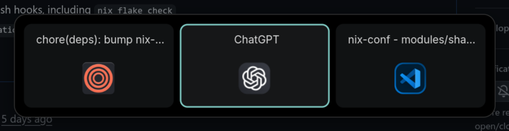

# Alt+Tab switching research

Research date: 2026-09-06. The desktop uses Hyprland 0.56 with Lua configuration and Noctalia 5.0. The repository pins Noctalia to `f96a407deb109c9db6f29db75e6fe487a5289e02`.

## Diagnosis

The existing `ALT + TAB` binding runs `noctalia msg window-switcher`. Noctalia puts the focused window first, sorts the remaining windows by workspace and position, and initially selects the second entry. That is not most recently used ordering. Its current implementation does support Alt release, Tab, Shift+Tab, and Escape, despite its documentation describing an Enter-confirmed picker. Repeated opening advances forward, and initial opening always advances forward. [Pinned Noctalia implementation](https://github.com/noctalia-dev/noctalia/blob/f96a407deb109c9db6f29db75e6fe487a5289e02/src/shell/switcher/window_switcher.cpp#L332), [Noctalia IPC documentation](https://docs.noctalia.dev/noctalia/ipc/shell/).

The desktop reproduction used keyboard events through uinput. After focusing a window on workspace 3 and returning to the initial window, Alt+Tab selected a browser on workspace 2 instead of the previously focused VS Code window on workspace 3. This confirms the ordering defect in the running session, independently of the source review.

An earlier upstream report, issue 3392, describes Alt-specific navigation failures. The maintainer reported a fix on July 13 and the reporter confirmed it worked. That closed report is relevant history, but it does not establish that the old keyboard bug persists in the pinned version. [Issue 3392](https://github.com/noctalia-dev/noctalia/issues/3392).

## Expected interaction

Windows documents holding Alt, pressing Tab repeatedly, and releasing Alt to switch to the selection. Shift+Alt+Tab moves backward. macOS documents the same hold, cycle, and release interaction with Command, with Shift reversing direction. macOS switches applications and has a separate shortcut for windows within an application; the Linux implementation here should retain individual window selection. [Microsoft task switching](https://support.microsoft.com/en-us/accessibility/windows/make-it-easier-to-focus-on-tasks), [Microsoft keyboard shortcuts](https://support.microsoft.com/en-us/windows/hardware/input-devices/windows-keyboard-tips-and-tricks), [Apple app and window switching](https://support.apple.com/en-ie/guide/mac-help/mchlb7beb9af/mac).

For this fix, use recent focus order and keep that order stable during each selection. A quick Alt+Tab should return to the previous window, repeated taps should alternate between the two recent windows, and Escape should cancel without changing focus. These are the acceptance criteria for the requested familiar switching behavior.

## Implemented fix

Use Hyprshell's switch mode through the existing Home Manager `services.hyprshell` module. The pinned nixpkgs already packages Hyprshell 4.10.8, so no additional flake input is needed. Its source sorts windows by Hyprland's `focus_history_id`. Version 4.10 supports the Lua compositor configuration and removed the earlier native Hyprland plugin. [Hyprshell overview](https://github.com/H3rmt/hyprshell), [4.10.8 recent-window sorting](https://github.com/H3rmt/hyprshell/blob/v4.10.8/crates/windows-lib/src/sort.rs#L107), [version migration notes](https://github.com/H3rmt/hyprshell/blob/v4.10.8/src/util.rs#L92).

The exact 4.10.8 configuration struct accepts the following settings. `filter_by = []` includes other monitors; its default filters to the current monitor. Leaving `overview` null disables the separate overview and launcher. [4.10.8 configuration schema](https://github.com/H3rmt/hyprshell/blob/v4.10.8/crates/config-lib/src/io/config.rs).

```nix
services.hyprshell = {
  enable = true;
  settings = {
    version = 4;
    windows = {
      overview = null;
      switch = {
        modifier = "alt";
        key = "Tab";
        filter_by = [ ];
        switch_workspaces = false;
      };
    };
  };
};
```

Remove the Noctalia Alt+Tab binding. Hyprshell registers its own forward, reverse, and modifier-release bindings at startup. Its reverse startup command passes `reverse: true`, and its Escape handler sends `CloseSwitch(false)`. The switcher takes a snapshot when opening and selects the next window in the requested direction. [4.10.8 generated bindings](https://github.com/H3rmt/hyprshell/blob/v4.10.8/crates/windows-lib/src/keybinds.rs), [4.10.8 switcher behavior](https://github.com/H3rmt/hyprshell/blob/v4.10.8/crates/windows-lib/src/switch/root.rs).

## Stuck picker and UI follow-up

The initial Hyprshell integration did not fix all of the user's symptoms. Its default cards were oversized, with a red selection outline and a separate hover background. More seriously, it could stay open after Alt was released.

Every compositor binding launches a separate `hyprshell socat` process. These processes can deliver `CloseSwitch` before `OpenSwitch`. The original handler ignores a close when the picker is already closed, then handles the late open without checking whether the modifier is still pressed. A concurrent open/close reproduction left the overlay stuck in 16 of 30 runs. A deterministic reproduction that delivers close before open failed every time. [Pinned IPC process generation](https://github.com/H3rmt/hyprshell/blob/v4.10.8/crates/core-lib/src/binds/transfer.rs), [pinned switch state handling](https://github.com/H3rmt/hyprshell/blob/v4.10.8/crates/windows-lib/src/switch/root.rs).

`overlays/temporary/patches/hyprshell-modifier-state.patch` fixes the installed package in four places:

- Read the left and right modifier state from Hyprland's `repl` IPC command and `hl.is_key_down`. `eval` only returns an acknowledgement and cannot supply this result.
- If an open arrives after Alt was released, select the recent window and close immediately.
- Ignore stale release messages while Alt remains held. Escape still cancels.
- Match modifier release bindings regardless of additional held modifiers, and apply repeated navigation directly rather than queueing it behind a later close.

The stylesheet uses the existing Stylix palette and font. Cards use `scale = 2.0`, with a single teal selection outline and no competing hover background. The overview and launcher remain disabled.

## Verification

Two scripts exercise the running compositor and daemon. They require an idle desktop and restore the original focused window.

```sh
python3 tests/hyprland/check_alt_tab_release_race.py /path/to/hyprshell
python3 tests/hyprland/check_alt_tab.py
```

The release-race script delivers close before open and verifies both the selected window and absence of an overlay. It also launches 30 concurrent open/close pairs. The keyboard test uses a temporary uinput keyboard to check recent-window selection, repeated switching, two forward steps, reverse entry with both modifier-release orders, reversing direction mid-selection, Escape, and ten quick taps.

The old package failed the deterministic release-race test. The corrected implementation passed it and the 30-run stress test, with zero stuck overlays. All 17 keyboard checks passed. The updated UI was inspected in a screenshot.

The patched package and desktop Home Manager files built successfully, and the activation-package derivation evaluated successfully. The persistent `hyprshell.service` is active and enabled. The deterministic regression and 30 concurrent-message checks passed again after a compositor reload. Hyprland reported no configuration errors, and the final service log contained no warnings or errors. Ruff and Nix formatting checks passed.

The installed generated files have a persistent GC root at `~/.local/state/nix/alt-tab/fixed-home-files`. Prior symlink targets are recorded in `previous-followup-links.json` beside it. Temporary probe services and the temporary binary were removed. A stray `uiI` in the font module's argument list was also removed because it blocked Nix evaluation.



Only the Hyprshell configuration, stylesheet, and user service need live activation for this follow-up. A normal Home Manager rebuild owns those paths afterward. Cross-workspace switching is covered; multi-monitor filtering is configured but was not physically tested.

## Alt released before Tab

The user then identified a release order missing from the original keyboard test: keep Tab pressed and release Alt first. This failed on the previous patched build. The compositor reported `Alt_L = false` and `Tab = true`, while the overlay remained visible. Sending `CloseSwitch` manually selected the correct window, isolating the failure to delivery of the release command.

The switcher now handles GTK's `EventControllerKey::key-released` signal for both sides of its configured modifier. Once the overlay owns keyboard focus, Wayland delivers this event directly, even when the compositor's release binding does not match the remaining chord. Existing key-state checks still protect quick taps and stale IPC messages. [GTK key-release signal](https://docs.gtk.org/gtk4/signal.EventControllerKey.key-released.html).

The regression test now verifies that releasing either Alt commits with Tab held, that reverse selection commits with Shift and Tab held, and that holding both Alt keys waits for the final Alt release. It checks that the overlay disappears as well as checking focus. These five additions bring the keyboard suite to 22 checks.

The new package and Home Manager files built successfully. The installed service points to the new store binary, with generated files rooted at `~/.local/state/nix/alt-tab/release-home-files`. Prior links are recorded in `previous-release-links.json`.

All 22 keyboard checks, the deterministic release-race check, and 30 concurrent open/close pairs passed on the installed service after a compositor reload. Hyprland reported no configuration errors.

## Intermittent missed release during opening

A later report described rare stuck overlays despite direct GTK release handling. A fixed-seed uinput timing probe reproduced two failures in 160 chords. Both used a 45 ms Alt+Tab hold followed by Alt-up and then Tab-up 5 ms later. Repeating that sequence with the existing trace logging enabled reproduced three failures in 16 attempts. The compositor reported both Alt keys up. The switcher trace contained `OpenSwitch` but no `CloseSwitch(true)` before Escape cancelled the overlay. This distinguishes a missing release notification from a close notification rejected because Alt was still held.

The likely gap is the keyboard-focus handoff: the initial key-state check can see Alt held, then Alt can be released before the overlay receives keyboard events. Handling the GTK release signal alone does not cover a release that never reaches the controller.

The patch now checks the compositor's modifier state every 80 ms while the switcher is open. If both modifier keys are up, it commits the highlighted selection and closes. Existing release handlers still commit immediately when events arrive. Closing or cancelling removes the timer, and dropping the component also removes it during GUI restarts. There is no polling while the switcher is closed. A queued check always reads the current state, so an old check cannot close a new selection while Alt is held.

The live regression is `python3 tests/hyprland/check_alt_tab_timing.py`. It failed against the previous installed package at attempt 68, using the same 45 ms / 5 ms sequence. It exercises 200 chords with both Alt keys, both release orders, and a fixed seed for varied timings. It also verifies that a sustained Alt hold keeps the picker open and that Escape prevents a later focus change. Tests restore the original focus and release their virtual keys on failure.

The final package and Home Manager files built successfully. The installed service uses `/nix/store/dgxw4vzfnwv4gihjbhi0i80a49awbrd1-hyprshell-4.10.8`, rooted through `~/.local/state/nix/alt-tab/recovery-home-files`. Prior symlink targets are recorded in `previous-recovery-links.json`. Only the switcher configuration, stylesheet, and service links were activated. The final installed service passed all 22 original keyboard checks, all 200 timing cases, the delayed-open regression, and 30 concurrent open/close pairs. Rust formatting and Python lint/format checks passed. Temporary service overrides and verbose logging were removed.

After a live compositor reload restarted the GUI, the sustained-hold/cancellation checks and all 200 timing cases passed again. The service remained active, with no configuration errors or service warnings.

## Nonblocking modifier queries

A review found that the modifier checks used synchronous socket reads without a timeout on the GTK thread. A proxy that withheld only modifier replies reproduced an unresponsive picker: Escape failed to dismiss it within 100 ms. This left the real compositor responsive and isolated the regression to Hyprshell's query handling.

All modifier checks now use asynchronous socket I/O, including the checks triggered by opening, navigation, and release events. One Lua request reads both modifier keys. A GLib deadline cancels the entire connection/write/read operation after 150 ms. Timer ticks reuse the pending request; fresh keyboard input aborts it before starting a replacement. Every request has an identifier, so a queued result from a cancelled request cannot close another selection or clear a newer request. Closing, Escape, and component teardown cancel both the request and the periodic timer. Timeout errors preserve the selection and retry on a later tick. They produce one warning until a successful response restores communication.

The new live regression is `python3 tests/hyprland/check_alt_tab_ipc_timeout.py /path/to/hyprshell`. It runs an isolated daemon behind a temporary local IPC proxy and restores the normal service afterward. The previous package failed the Escape responsiveness assertion. The new package passed Escape during stalled IPC, cancellation without continued polling, reopening after cancellation, bounded timeout retries with no overlapping requests, correct window selection when replies resumed, and one warning during repeated timeouts.

The asynchronous socket future runs through GLib's event loop and waits without blocking GTK. It does not create a worker thread per check. The existing 80 ms fallback remains active only while the picker is open. This change covers the added modifier-state queries; unrelated upstream compositor operations retain their existing implementation.

The package and Home Manager files built successfully. The installed service uses `/nix/store/c46hkwgw417jsrrspk8nj1xwqdpmmxgy-hyprshell-4.10.8`, with generated files rooted at `~/.local/state/nix/alt-tab/async-home-files`. Prior symlink targets are saved in `previous-async-links.json`. No temporary service override remains.

After activation and a compositor reload, the installed service passed all 22 keyboard checks, all 200 timing cases, the delayed-open regression, and 30 concurrent open/close pairs. The service remained active with no configuration errors or service warnings. Rust formatting and Python lint/format checks passed.
