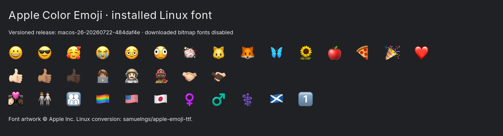

# Apple Color Emoji on Linux

Apple Color Emoji is installed as an optional font on desktop. Applications and
websites requesting that family can use it. The default `emoji` family remains
Noto Color Emoji. The shared browser setting
`gfx.downloadable_fonts.keep_color_bitmaps = false` remains disabled.

## Reproducible source

The personal package `apple-color-emoji` reuses the improved `apple-fonts`
manifest installer through a new `fromSource` interface. It fetches a single
font using the explicit [macos-26-20260722-484daf4e release URL](https://github.com/samuelngs/apple-emoji-ttf/releases/tag/macos-26-20260722-484daf4e)
and verifies its SHA-256 against the published asset digest:

```text
e37c7af6265ac4a0af6d57bc65e86109a776d9966e8343334557f63da482516f
```

This is samuelngs/apple-emoji-ttf's third-party Linux conversion, not an
Apple-hosted font download. Apple Color Emoji is absent from the downloadable
Font8 catalog used by the Apple font package. An Apple recovery API query
returned a versioned BaseSystem image URL, but its download requires a temporary
asset token. A full macOS installer is much larger than this 111 MiB font asset.
The chosen package needs neither a live catalog query nor a private Mac export.

The font remains unfree Apple artwork; the converter's MIT license does not
license that artwork. See the [package notices](../pkgs/pkgs/by-name/ap/apple-color-emoji/README.md).
The package installs no upstream Fontconfig override rules. Linux alone receives
this conversion; macOS retains its native Apple Color Emoji family.

## Compatibility repair

The older native Apple font available in Downloads loaded by name but produced
no color in the original EmojiTest page in Zen. The pinned Linux conversion uses
CBDT/CBLC bitmap tables at eight sizes from 20 to 96 pixels, with Apple's AAT
composition tables. Local installation works with the browser bitmap-download
preference disabled.

The initial browser check found three advertised glyphs with no bitmap artwork:
female sign, male sign and medical symbol. Their standalone emoji were blank.
The repair discovers missing artwork by shaping Unicode 17's RGI sequences; it
contains no list of codepoints to replace. It fills only absent bitmap slots
from nixpkgs' pinned Noto Color Emoji 2.051 and retains Noto license notices.
These three standalone symbols therefore use Noto artwork. All existing Apple
artwork, metrics, character mappings and composition tables are preserved and
compared against the downloaded font during the build.

Deleting the blank character mappings would break AAT profession/gender
composition. Supplying artwork preserves those mappings and fixes both ordinary
and emoji-presentation uses. The package records source, fallback and generated
font hashes plus each supplemented glyph in its installed documentation.

## Validation

- The Apple font import tooling passes 13 tests, including stable single-file
  import names, byte/face preservation, archive safety and tamper detection.
- Package checks cover all 3,953 Unicode 17 RGI sequences and require bitmap
  artwork at all eight sizes. The 396 two-layer compositions retain their
  overlapping positions and one-em advance.
- Zen renders all 3,953 entries visibly at the expected width. 3,736 contain
  colored pixels; the remaining entries include monochrome symbols.
- All 13 checked Fontconfig selections are unchanged, including normal text,
  CJK, Arabic, Hindi and the Noto emoji default.
- Two independent repairs with the pinned Python dependencies produce the same
  bytes as the installed Nix output. The generated font SHA-256 is
  `04f3a8c1207247bb6361832a9abf34516228bf22ea42949418f376005174f367`.
- The personal flake evaluates across supported platforms, and the desktop
  configuration evaluates. Targeted font packages are built and activated;
  unrelated system changes are not activated by this task.

This verifies Linux/Zen rendering, not every toolkit. In particular, upstream
reports potential Qt rendering limitations; Qt application rendering has not
been validated here. Existing applications may need to restart to refresh their
font lists.



Re-run the browser check with the repository's Selenium/Pillow/uharfbuzz test
environment, an installed font, and the pinned Unicode 17 emoji-test.txt:

```sh
python tests/browsers/check_apple_emoji.py \
  --font /path/to/installed/font.ttf \
  --emoji-data /path/to/emoji-test.txt \
  --headed --browser /path/to/zen-beta --geckodriver /path/to/geckodriver \
  --output /tmp/apple-emoji-browser
```

[Browser results](assets/apple-emoji/browser-results.json),
[upstream blank-symbol evidence](assets/apple-emoji/upstream-browser.json),
[repair provenance](assets/apple-emoji/artwork-repairs.json), and
[reproducibility results](assets/apple-emoji/reproducibility.json) are retained.
