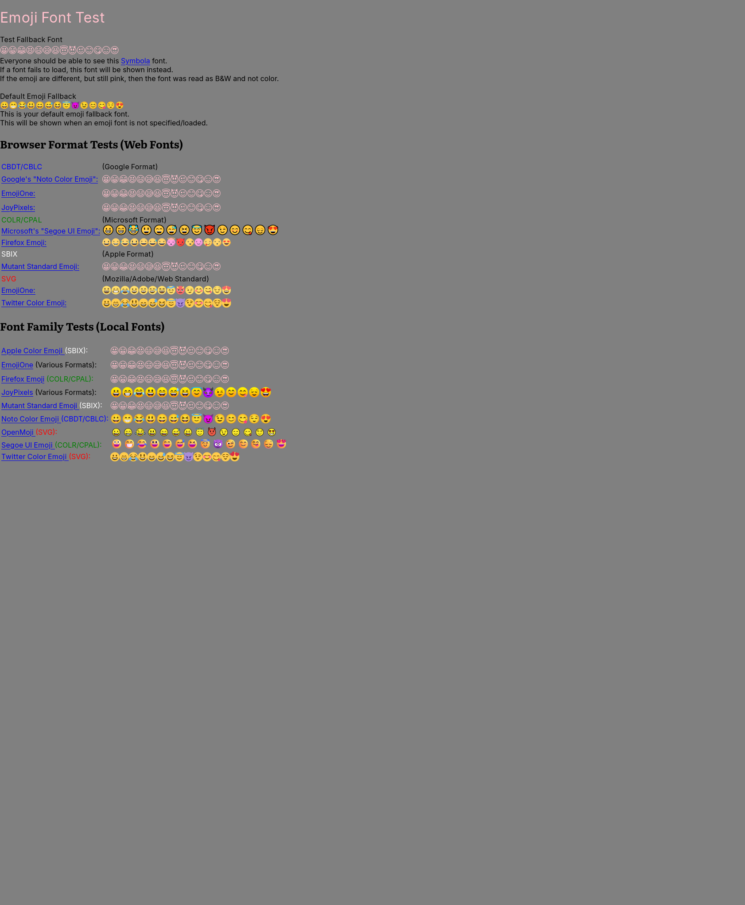

# April93 EmojiTest research

Latest follow-up: Mutant Standard is now installed as a compiled COLRv1 font.
The original page renders 8/9 local families in color; its historical web-font
result remains 4/8. See [the current results](mutant-standard-emoji.md).

Reviewed on 2026-09-05 for the desktop Zen font investigation.

The requested repository is [April93/EmojiTest](https://github.com/April93/EmojiTest). Its README describes a browser font-format check and a local emoji-font check. The reviewed revision is `ccd4ff0437bb9d519846c0cfd1bf9ab06a18a018`, dated 2020-09-29. [README](https://github.com/April93/EmojiTest/blob/ccd4ff0437bb9d519846c0cfd1bf9ab06a18a018/README.md), [commit](https://github.com/April93/EmojiTest/commit/ccd4ff0437bb9d519846c0cfd1bf9ab06a18a018)

Every row uses the same 14 faces, `😀😁😂😃😄😅😆😇😈😉😊😋😌😍`. The static page has no automated pass counter or Unicode data version. Its eight web-font rows cover Noto Color Emoji, EmojiOne Android, JoyPixels, Segoe UI Emoji, Firefox Emoji, Mutant Standard, EmojiOne SVG, and Twitter Color Emoji. These exercise CBDT/CBLC, COLR/CPAL, sbix, and SVG. Nine local-font rows request Apple Color Emoji, EmojiOne, Firefox Emoji, JoyPixels, Mutant Standard Emoji, Noto Color Emoji, OpenMoji, Segoe UI Emoji, and Twitter Color Emoji. Passing these samples alone does not establish complete emoji coverage. [Page source](https://github.com/April93/EmojiTest/blob/ccd4ff0437bb9d519846c0cfd1bf9ab06a18a018/index.html)

The CSS gives each web font a private family name and uses `SYMBOLA-font_face` as its fallback. Local rows request the named installed family before Symbola. Apple web-font loading is commented out. A local font with a different family name can therefore fall back even when another emoji font renders the characters correctly. [Font CSS](https://github.com/April93/EmojiTest/blob/ccd4ff0437bb9d519846c0cfd1bf9ab06a18a018/fonts.css)

The page deliberately colors test text pink. Symbola is the monochrome control. Pink glyphs matching that control mean fallback; different pink glyphs mean the requested font rendered without color. Color and visible pixels must be checked as well as font loading. [Test CSS](https://github.com/April93/EmojiTest/blob/ccd4ff0437bb9d519846c0cfd1bf9ab06a18a018/test.css), [page instructions](https://github.com/April93/EmojiTest/blob/ccd4ff0437bb9d519846c0cfd1bf9ab06a18a018/index.html#L14-L22)

Mozilla still lists an open issue for sbix downloadable fonts rejected by the sanitizer. This is relevant when interpreting a failed Mutant Standard web-font row, but does not establish that the installed Zen version has that failure. It needs a browser test. [Mozilla bug 1422351](https://bugzilla.mozilla.org/show_bug.cgi?id=1422351)

For broader coverage, Unicode publishes separate display-test data. Parsing the Unicode 17.0 file gives 3,944 fully qualified sequences, 9 components, 1,029 minimally qualified sequences, and 243 unqualified sequences. Its header defines the RGI set as the union of fully qualified sequences and components. The file includes skin tones, flags, and joined sequences absent from April93's sample. [Unicode 17.0 display-test data](https://www.unicode.org/Public/17.0.0/emoji/emoji-test.txt)

Recommended verification records actual web-font load and color rendering, installed-family availability, and default fallback coverage separately. Replacing every optional family with an alias can make the page look colored without proving that the named fonts work. Preserve the page's fallback control and report absent families plainly.

## Desktop results

Tested the pinned page without modifying its CSS, fonts, or fallback control. Its files were served from localhost. The results were reproduced in Zen 1.21.15b in a visible Wayland window. A screenshot and machine-readable record are saved alongside this report.

| Test row | Web font | Local family |
| --- | --- | --- |
| Noto Color Emoji | Rejected by sanitizer, CBDT | Color rendering passes |
| EmojiOne Android / EmojiOne | Rejected by sanitizer, CBDT | Not installed |
| JoyPixels | Rejected by sanitizer, CBDT | Color rendering passes |
| Segoe UI Emoji | Color rendering passes | Color rendering passes |
| Firefox Emoji | Color rendering passes | Not installed |
| Mutant Standard Emoji | Rejected by sanitizer, missing required `post` table | Not installed |
| EmojiOne SVG | Color rendering passes | Covered by EmojiOne local row above |
| Twitter Color Emoji | Color rendering passes | Color rendering passes |
| OpenMoji | No web row | Color rendering passes |
| Apple Color Emoji | No web row | Not installed |

The result is **4/8 web-font rows and 5/9 local-family rows rendering in color**. The deliberately pink Symbola control is correct. Its sample font emits a `maxZones` warning but remains usable. OpenMoji's CSS family alias renders correctly even though an exact `local("OpenMoji")` face-name probe fails; that probe must not be mistaken for the page's family-matching result.

The three rejected CBDT files downloaded successfully and produced `no supported glyph data table(s) present`, followed by `rejected by sanitizer`. Firefox's `gfx.downloadable_fonts.keep_color_bitmaps` preference defaults to false. Mozilla explicitly documents that enabling it preserves bitmap tables by bypassing OTS validation. Changing that preference merely to make this test page pass would change the browser's font-validation policy. The preference was left unchanged. [Firefox preference definition](https://github.com/mozilla-firefox/firefox/blob/main/modules/libpref/init/StaticPrefList.yaml#L7179-L7185)

The Mutant sample has its own concrete validation error, `post: missing required table`. Installing a local font would not repair the file served by the test page. No substitute aliases or edited test files were used to conceal these failures.



## Full Unicode emoji coverage

Separately checked all **3,953 Unicode 17 RGI entries**, including fully qualified sequences and standalone emoji components. The installed `noto-fonts-color-emoji` 2.051 font shaped every entry to one non-missing glyph using HarfBuzz. Its embedded version is `noto-emoji:20250818:e92753bfa55fd449e427d4d325f9c8c40408c74e`.

Zen canvas rendering with `32px emoji` painted every entry and showed no sequences wider than a single emoji cell. New Unicode 17 faces, ballet dancers, skin-tone combinations, flags, and joined sequences were included. Achromatic emoji such as black hearts and silhouettes were not incorrectly counted as failures for lacking colored pixels. A sample grid of new and achromatic glyphs was visually inspected. These checks establish glyph availability and composition, not an exhaustive visual comparison of every drawing with a reference image.

Google Fonts also installs an older Noto Color Emoji 2.048 file, which by itself lacks 148 Unicode 17 entries. The newer dedicated font is already installed and Zen's tested fallback covers those entries. Zen already covered these entries, but the older copy remained the default selected by Fontconfig. The follow-up correction below makes that selection deterministic for other applications too.

[Machine-readable test record](assets/zen-fonts/emojitest-results.json)

## Outcome

Every row of April93/EmojiTest does **not** pass on this desktop. Normal Unicode 17 emoji coverage passes the checks above. The remaining page failures concern optional font names and rejected historical web-font files. The font-selection correction below addresses the remaining default-font inconsistency. Browser font-validation settings and optional legacy families are unchanged. The earlier Twemoji numeric-glyph repair remains in place.

## Follow-up correction

After the user requested the appropriate fixes, the direct Fontconfig-selected font was tested with `tests/fonts/check_emoji_coverage.py`. Before the correction it selected Google's bundled Noto Color Emoji 2.048 and failed 148 entries, passing 3,805 of 3,953.

`modules/shared/fonts.nix` now excludes the older `share/fonts/truetype/NotoColorEmoji-Regular.ttf` duplicate and `NotoColorEmojiCompatTest-Regular.ttf` test face from Fontconfig scans. It retains the dedicated `noto-fonts-color-emoji` package and all other font families. The scan rule covers copies introduced by Stylix and older profile directories. It is declared for the shared NixOS font module and explicitly enabled for Linux Home Manager profiles, including profiles with older `home.stateVersion` values.

The selected font now comes from `share/fonts/noto/NotoColorEmoji.ttf`, version 2.051. Results after applying the generated rule:

- Default Fontconfig emoji face: 3,953/3,953 sequences shape to one supported glyph.
- Zen's default emoji canvas: 3,953/3,953 entries paint without blank or split sequences.
- Visible Wayland Zen numeric regression: 160/160 digits render.
- Full desktop NixOS system build: passed on `desktop`.
- Nix formatting, Python lint, formatting, type checking, and diff whitespace checks passed.

Run the reusable font-selection check with the official Unicode data file:

```sh
nix shell --impure --expr '
  let pkgs = (builtins.getFlake (toString ./.)).inputs.nixpkgs.legacyPackages.x86_64-linux;
  in pkgs.python3.withPackages (p: [ p.uharfbuzz ])
' --command python3 tests/fonts/check_emoji_coverage.py \
  --emoji-data /path/to/emoji-test.txt
```

`--font /path/to/font.ttf` checks a specific font instead. The default uses `fc-match emoji`, so the regression catches an incomplete duplicate taking precedence again.

The rule is active at `~/.config/fontconfig/conf.d/60-hm-current-emoji.conf`. A concurrent system activation completed at 23:50 PDT and installed the rule through Home Manager. Both `/run/current-system` and the boot-default system profile point to that generation, `53smgxw69r0pvw9pgxj9z5ggriwv9076`. The separately verified build remains available at `/tmp/zen-emoji-fixed-system`. No further activation is required. Existing applications may need a restart to refresh their font lists.

## Optional-family follow-up, 2026-09-06

The user subsequently authorized the remaining fonts where they require no rendering or security compromises. Authentic upstream Firefox Emoji and EmojiOne fonts are now installed as optional named families, with their licenses and attribution. The original test page now passes **7/9 local-family rows**; its web-font result remains **4/8**. No browser validation policy was relaxed. Apple and Mutant remain excluded. See the [installation, sources, and validation report](optional-emoji-fonts-research.md).
