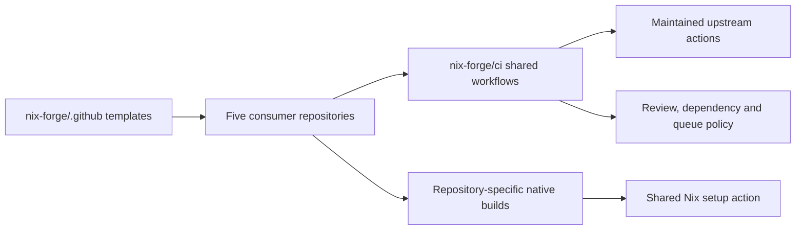

# Shared CI and NUR implementation

Implemented 2026-09-07, America/Los_Angeles. The design follows
[the research](github-actions-strategy-research.md): own the organization policy
and reuse maintained upstream actions for installation, scanning and caching.

## Published shared repositories

- [nix-forge/ci](https://github.com/nix-forge/ci) contains reusable lockfile, CodeQL,
  dependency-review, reviewer-request, Dependabot auto-merge and NUR workflows.
  Small composite actions provide Nix setup, queue reconciliation and queue
  completion callbacks. Platform builds remain in each consumer repository.
- [nix-forge/.github](https://github.com/nix-forge/.github) provides organization
  workflow templates and the public profile. CI validates the templates.
- Reusable calls use full commit SHAs. The latest library release is
  [immutable v1.0.4](https://github.com/nix-forge/ci/releases/tag/v1.0.4), commit
  `03eb849e788bd71ac08afab6a1135a6ff6514f3c`. It includes the low-severity
  dependency gate, initial queue-ref readiness and failed-validation reporting.
  Templates and package hardening PR #48 use this release. Earlier
  consumer policy corrections use immutable v1.0.2 where only dependency review
  changed; unchanged calls retain their tested pins. Dependabot proposes updates.

Both new repositories require pull requests and their successful `validate` check
on main, including for administrators. The shared CI repository also requires
`CodeQL / analyze`, which scans its Python automation and GitHub Actions files. They prohibit force pushes and branch
deletion, require linear history, enforce action SHA pinning and default to a
read-only workflow token. Repository settings were verified through GitHub's API.
Both repositories also have native merge queues with validation required and no
bypass actors.

## Consumer rollout

The migrations remove thousands of duplicated lines from the consumer `.github` trees.
That count includes consolidating the queue implementation and regression tests;
it does not count new files in the shared repository as a reduction in total code.

| Repository | Migration |
| --- | --- |
| nix-config-framework | [PR #40](https://github.com/nix-forge/nix-config-framework/pull/40) |
| vpn-confinement | [PR #56](https://github.com/nix-forge/vpn-confinement/pull/56) |
| nixpkgs-personal | [Combined PR #46](https://github.com/nix-forge/nixpkgs-personal/pull/46) |
| nix-seal | [PR #80](https://github.com/nix-forge/nix-seal/pull/80) |
| nix-conf | [PR #189](https://github.com/nix-forge/nix-conf/pull/189) |

All five initial migrations have merged after PR and protected queue validation.

Required-check names are migrated only after observing the replacement checks
succeed on the actual PR revision. Existing check coverage and GitHub Actions app
identity are preserved. The initial package rollout required 19 checks, including
locked and unstable NUR checks, explicit Python and Swift analysis, Swift quality,
both sanitizers and both compiler audits.

On 2026-09-08, [package PR #50](https://github.com/nix-forge/nixpkgs-personal/pull/50)
passed all 22 planned required checks at
`4c4feccae8707f564d0961587fa98934cf4da754` before the requirements changed.
The queue was empty and the existing protection matched its saved
configuration. The update retained 16 contexts and replaced the three old Swift
quality and sanitizer names with six package-specific names. API readback verified
exactly 22 required contexts, all bound to GitHub Actions, with the existing
strictness setting preserved. Merges use the native queue and its checks.
No administrator bypass is used. The shared CI and organization repositories also
require their native merge queues. Their CI workflows emit `validate` for
`merge_group` events.

Native Linux and macOS coverage, Swift's manual CodeQL build, Rust assurance and
release checks, documentation deployment and Scorecard publication retain their
repository-specific definitions. No hosted workflow builds the nix-conf desktop
system closure. Dependabot minor/patch groups now use the actual `update-types`
field. New templates, named jobs and NUR evaluation summaries improve onboarding
and failed-run diagnosis.

## Security and automation behavior

- Shared actions and their third-party dependencies use full commit SHAs.
- Privileged queue reconciliation executes the pinned shared action's script
  without checking out caller code. Existing commit, run-attempt and job-result
  checks are retained.
- Automated admission refuses PRs changing workflow, local action or automation
  script files. Those changes need deliberate maintainer admission.
- Dependency review fails on newly introduced vulnerabilities at low severity
  or higher. A parallel workflow audit caught the initial shared release's
  unintended high-severity threshold. Version 1.0.2 corrects it. The package PR
  and organization template use the fixed source. The framework, VPN, nix-seal
  and nix-conf corrections have merged. The combined package PR also passed the
  corrected gate and merged after protected queue validation.
- Reusable workflows request explicit permissions and do not inherit all secrets.
  PR build jobs receive no new privileged credential.
- PR #48 removes duplicate execution of a downloaded
  `remindctl` binary from the privileged package updater. It retains archive
  layout, arm64 Mach-O and hash validation. The package's existing native
  install check still verifies the executable version under read-only CI.
  Five regression tests pass; they catch execution in the original updater.
  The package derivation remains unchanged. The final PR's native macOS log
  confirms the grouped `remindctl` check skipped rebuilding that unchanged recipe.
- The existing GITHUB_TOKEN queue fallback remains. Moving admission to a GitHub
  App needs an installed App and a private key, followed by proof that its
  admission triggers native merge-group checks. No App credential is configured
  by this change. Scheduled reconciliation remains at the existing frequency to
  keep fallback validation from timing out.
- GitHub enforces full action SHA pins on all five consumers; VPN confinement's
  previously disabled setting was enabled after checking its pins.
- External binary-cache publication remains unconfigured. Unfree fonts and
  applications retain their package-specific redistribution controls.

## Cache experiment

The shared setup uses the pinned Determinate installer and optionally
`nix-community/cache-nix-action`. Store caching defaults to disabled. It saves only
on trusted default-branch pushes or dispatches. Keys include platform, Nix version,
job scope, lockfiles and commit; restoration does not cross lockfile identities.
Garbage collection targets 2 GiB before saving, but live roots can exceed that
size. The action does not request cache-purge permission. It archives the Nix store;
package substitution settings do not exclude files from that archive. Fork PRs can
restore base-branch caches, so jobs producing secrets or outputs with redistribution
restrictions remain uncached. See the
[GitHub cache access rules](https://docs.github.com/en/actions/reference/workflows-and-actions/dependency-caching#restrictions-for-accessing-a-cache).

The framework pilot ran the same Linux discovery check and evaluation at commit
`07e972f7e702603fda09860f4229961458c803ce`. Values below sum Nix setup, the workload
and Nix teardown, excluding runner provisioning and checkout.

| Run | Store cache disabled | Store cache enabled |
| --- | ---: | ---: |
| [Cold store](https://github.com/nix-forge/nix-config-framework/actions/runs/34174056740) | 23 s | 33 s |
| [Warm store](https://github.com/nix-forge/nix-config-framework/actions/runs/34174298367) | 22 s | 28 s |

The warm store restored approximately 160 MB successfully. It reduced the workload
from 13 to 6 seconds, but setup increased from 8 to 21 seconds. This small pilot
does not demonstrate an overall performance benefit, so `NIX_CI_CACHE=false` is
explicitly set on the framework repository. These two runs are not a statistical
benchmark of larger package builds. The manual benchmark remains available for
future measurements. The installer's own download cache is present in both cases.

## NUR preparation

The published package repository gains a root entry point accepting caller-provided
`pkgs`, a pinned NUR restricted evaluator, supported-platform metadata assertions,
locked/current-unstable CI and a weekly compatibility check. The combined package
set passed 86 package/platform evaluations for each input. User documentation covers direct-flake
and NUR usage, unfree opt-in, compatibility expectations and submission procedure.
Registration is prepared but has not been submitted upstream.

The existing [package PR #46](https://github.com/nix-forge/nixpkgs-personal/pull/46)
was initially ahead of the migration. Its macOS queue job failed when the runner
could not resolve `github.com` during a source download. After GitHub removed that
failed queue entry, the validated integration was added to #46 with a fast-forward
push. The overlapping #47 was closed. The obsolete failed run was canceled.

The combined PR preserves font contracts, evaluation restrictions and build
limits; adds font provenance; corrects Firefox Emoji's Apache 2.0 Nixpkgs license
identifier; and retains Noctalia's vendored MIT notice. Both NUR inputs pass all
86 evaluations on this tree. PR #46 merged at
`327a24558aec56486e2e82d8ee494a983f133bd2`. Its protected queue run
[34184084383](https://github.com/nix-forge/nixpkgs-personal/actions/runs/34184084383)
also passed all three native builds and both NUR checks.

The combined package CI also retries recognized transient source-fetch failures
up to twice on the same runner, retaining already built derivations. It preserves
failure status and rejects compiler, linker, hash and permanent HTTP failures.
Four regression tests cover 12 success, recovery and refusal scenarios. This
addresses the observed macOS DNS failure without changing sources or hashes.

The package CI now compares base and current Nix derivation paths before rebuilding
selected packages. Identical recipes skip recompilation. Failed base evaluation
falls back to building. Explicit font and application contracts remain active.
Six initial fixture scenarios used real Nix evaluation and recorded build commands.
A follow-up review caught an unavailable nonempty base SHA failing at `git diff`
before that fallback. [PR #48](https://github.com/nix-forge/nixpkgs-personal/pull/48)
extracts the selection script and rebuilds all current packages when history or
the diff is unavailable. Ten regression scenarios pass locally, including the
missing-history cases and fatal current-package evaluation errors. The original
script fails the new missing-base and diff-failure tests. A
separate comparison found all 86 package/platform derivation paths unchanged by
the NUR metadata and notice fixes relative to PR #46's head. Evidence and the
reproducible fixture harness are saved under the migration `evidence` directory.

All native PR builds passed on revision
`300901c62bb172ab4f647293ef666fb9f294ef26` in
[run 34178813800](https://github.com/nix-forge/nixpkgs-personal/actions/runs/34178813800).
The x86 job took approximately 87 minutes, ARM Linux 54 minutes and macOS 49
minutes. The x86 log places about 51 minutes in the Mutant Standard build and
26 minutes in Noctalia. The Windows source download was not the dominant cost in
this run. Logs also confirm that unchanged packages skipped rebuilding. These
are observations from one cold build, not a controlled before/after benchmark.

PR #48 also records the evaluated checkout, immutable Nixpkgs source revision
and NAR hash in NUR artifacts. It verifies the lockfile hash, bounds source
resolution and prefetch commands, and clears ambient Nix search paths during
restricted evaluation. Readable job summaries list the platform totals and link
to both source revisions. A negative test rejects a mismatched lockfile hash.
All final PR checks passed at `787122f5d294dfdc998a8fd014718fc1f9aa6ade`,
including the three native build jobs. An already-running Dependabot lockfile
update, #49, was allowed to finish and merge before the protection cutover.
PR #48 merged at `2ff7ef7da57c97c782d6f9b16dd24d01ce89dff3` after all 19 required checks passed
against that updated main. The final [native CI and NUR run](https://github.com/nix-forge/nixpkgs-personal/actions/runs/34192447944),
[CodeQL run](https://github.com/nix-forge/nixpkgs-personal/actions/runs/34192447939)
and [dependency review](https://github.com/nix-forge/nixpkgs-personal/actions/runs/34192447953)
all passed through genuine `merge_group` events. The queue NUR artifacts record
locked Nixpkgs `801bef6abd86b91e51083066b83fb354a11fc640` and unstable
`dc5d91f840324650bac8c379428c7037a416959a`, with 86 supported evaluations and
13 restricted-index entries for each.

The expanded local package collection also receives source-provenance fixes for
precompiled fonts and its equivalent NUR integration. It passed all 86 supported
package/platform evaluations for both locked and current unstable Nixpkgs. The
restricted Linux index returned 13 entries for each. These NUR checks evaluate compatibility. Separately, the follow-up review built
all 27 native x86_64-linux package outputs; Darwin build coverage remains the
responsibility of native CI.

See [NUR readiness](../pkgs/docs/nur-readiness.md) for exact results, metadata work
and the publication boundary. The package reorganization and newer configuration
changes are committed in a separate follow-up review. They remain separate from
these clean migration PRs; the font and Noctalia changes already reviewed in #46
are included.

## Validation and local placement

The shared library passed its queue regression tests, actionlint, pedantic Zizmor,
YAML lint and Ruff locally and in
[GitHub CI](https://github.com/nix-forge/ci/actions/runs/34173354615).
The subsequent queue-liveness repair increased the suite to 30 tests and passed
PR and queue validation in [CI PR #3](https://github.com/nix-forge/ci/pull/3).
Failure reporting increased the suite to 35 tests and passed the same checks in
[CI PR #4](https://github.com/nix-forge/ci/pull/4).
The shared repository now calls its own CodeQL workflow on the reviewed commit.
[CI PR #5](https://github.com/nix-forge/ci/pull/5) passed the Python and Actions scan
and protected queue validation, then merged at
`d68141e994ce12bd9f9ad915ff208e3652322bdb`. GitHub reported no open CodeQL
alerts at this check. The local workflow syntax follows
[GitHub's same-commit reuse rules](https://docs.github.com/en/actions/how-tos/reuse-automations/reuse-workflows#calling-a-reusable-workflow);
a documented Zizmor exception retains `./` until the pinned actionlint supports `$/`.
This changes the library's own validation and requires no consumer runtime update.

Each consumer passed its local workflow hooks; applicable native pre-push checks
also passed. GitHub runs the full existing native matrices on the PR and again in
the merge queue. NUR additionally runs its own restricted-evaluator matrix.

The new report passed its formatting and document checks in the original dirty
checkout. That checkout's hook also runs repository-wide Python lint and found
unrelated existing work in `tests/hyprland/run-upstream-local.py` and
`tests/systemd/check_chatgpt_oom.py`. Those files were not changed by this migration.
The clean nix-conf migration's repository-hooks job passed on GitHub.

Shared library checkout: `~/Developer/ci`.
Organization templates checkout: `~/Developer/nix-forge-community`.
Clean consumer checkouts, protection backups and cache timing JSON are under
`~/Developer/nix-forge-ci-migration`.

The clean checkouts avoid committing or overwriting existing work in
`~/Developer/nix-conf` and its dirty submodules. Incorporate the merged
remote CI changes when reconciling that work; its local branch and submodule
pointers have not been forcibly reset or advanced.

## Root native build selection

The root CI compares every Linux package derivation against the PR or queue base,
including the historical submodule revisions. Documentation-only changes therefore
keep integration checks while avoiding unchanged package builds. Missing history
or an unusable base selects every current output; a current evaluation failure
fails the job. An empty selection exits explicitly without requesting a default
Nix build. Darwin retains its representative native builds and Core Text checks.

Older queue dispatchers omit the root's optional base input. On the exact event
SHA under GitHub's reserved main queue ref, the selector uses the candidate's first
parent. This supports both squash candidates and merge commits. Ordinary manual
dispatches without a base build all outputs.

Nineteen real Git/Nix regression tests cover package changes, errors, submodules
and dispatch forms. A documentation-only comparison in this repository selected
none of its 28 Linux outputs. A replay against PR #48's actual squash candidate
also selected no unchanged package recipes. These comparisons establish selection
behavior; native checks still validate changed outputs on the hosted runners.

The repair merged in [root PR #193](https://github.com/nix-forge/nix-conf/pull/193)
at `0649afd5e2c34293fc278be63f128052e85a8b3f` after all three platform checks and
protected merge-group validation passed.

## Swift quality shells

The package quality matrix uses focused Nix shells. OCR Capture keeps its existing
two-tool shell. Finder Favorites reuses the 16 tools declared by its quality hook,
so the hook and CI share one tool list. Xcode and the runner supply the native
compiler and Nix commands. All quality commands, sanitizers and compiler audits
remain enabled.

The earlier full development shell had 84 tool entries. Both quality jobs were
still constructing that environment when the run was superseded, before either
quality script started. With the focused shells, hosted OCR quality passed in
3 minutes 42 seconds and Finder quality in 4 minutes 53 seconds. These are
observations from separate runners, not a controlled benchmark.

## Shared CI version 2

The September 8, 2026 consolidation keeps common policy in
[nix-forge/ci](https://github.com/nix-forge/ci) and onboarding templates in
[nix-forge/.github](https://github.com/nix-forge/.github). Existing repository
check names and native build definitions remain stable. Shared composite actions
now validate workflow contracts and run repository hooks and publication checks.
The root retains its stricter publication script and submodule checks.

The queue reconciler owns automatic admission. The separate auto-merge wrapper
has been removed; automation paths and rename source paths require maintainer
admission. Required workflows still run for native merge groups and explicit
queue dispatches. Superseded PR runs can be cancelled without cancelling active
queue validation. All shared references use one tested immutable release.

See the [shared design, research and measurements](https://github.com/nix-forge/ci/blob/main/docs/architecture.md)
for the security boundaries, migration contract and cache experiment. Broad store
caching remains disabled because the measured pilot did not establish a useful
end-to-end improvement. Package builds retain derivation-based selection and
conservative fallback when base evaluation is unavailable.

Repository hooks use the focused `ci` development shell through the shared
action's `dev-shell` input. This shell contains the configured hook tools and
scanners without depending on the built seal CLI. The default interactive shell
still includes that CLI, and native secret-template checks still build and test
it. This removes a product build from lint without changing integration coverage.

## Discovered CI inputs

Root native CI builds the current `checks.<system>` output instead of a second
list of check names. New checks are included automatically; deleted checks are
not requested. Separate Nix processes retain the evaluator memory bound and
report all failing checks before failing the job. Platform applicability belongs
in the flake that defines the check.

Partition materialization follows tracked nested flakes, including initialized
submodules. Submodule hooks follow the checked-out submodule inventory. The
lockfile matrix uses tracked flakes in the owning repository and reports through
the stable aggregate described in [merge queue operations](../.github/merge-queue.md).
Explicit supported runners and deployment policy remain deliberate configuration.

The root flake's `ciChecks` output contains ordinary checks for each system.
It derives the host-only exclusions from deploy-rs's own check inventory because
those checks build the complete desktop closure. Full `checks` retain deployment
validation for the desktop host. New ordinary checks enter CI without editing
workflow lists; new deploy-rs checks remain under the same build-placement policy.

Configuration evaluation checks follow `nixosConfigurations` and
`darwinConfigurations`. Each native configuration must instantiate its system
derivation. Foreign configurations produce a skipped-platform report. The check
report discards the system derivation's string context so evaluating a host does
not turn the CI check into a full system build. Host additions and removals update
these checks automatically; runner support remains explicit deployment policy.
