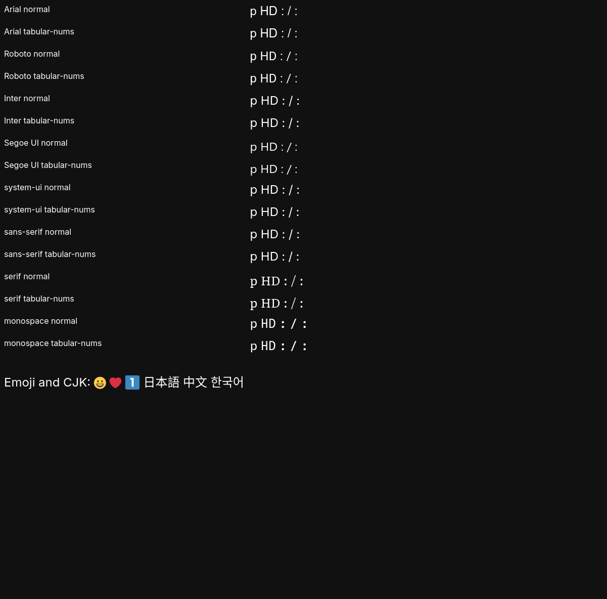
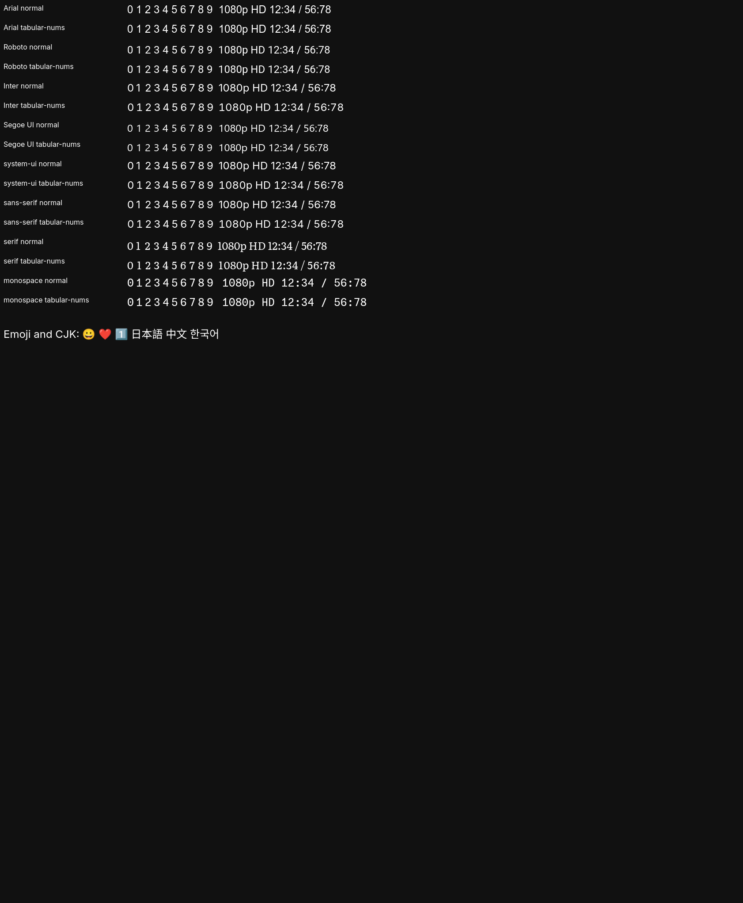

# Zen missing numbers on the desktop

Investigated on 2026-09-05 with Zen 1.21.15b on NixOS desktop.

The missing YouTube timestamps, resolution numbers, and GitHub counters match a reproducible local font substitution failure. The installed `twemoji-color-font` package contributes `46-twemoji-color.conf`. Removing that policy, while retaining every font file, changes the browser rendering check from 0/160 visible digits to 160/160. The corrected configuration also passes in a visible Wayland window with NVIDIA hardware acceleration enabled.

## Cause and primary sources

Twemoji's bundled policy prepends Twitter Color Emoji to ordinary serif, sans-serif, and monospace requests. It also aliases Noto Color Emoji, Apple Color Emoji, and Segoe UI Emoji to Twitter Color Emoji. This conflicts with this repository's Stylix font choices. [Twemoji's installation documentation](https://github.com/13rac1/twemoji-color-font#install-on-linux) explicitly says installation changes the system's default text fonts. [Its actual Fontconfig policy](https://github.com/13rac1/twemoji-color-font/blob/v15.1.0/linux/fontconfig/46-twemoji-color.conf) contains these replacements.

Mozilla describes the same failure mechanism in [bug 1565588, comment 6](https://bugzilla.mozilla.org/show_bug.cgi?id=1565588#c6). An emoji font can claim support for ASCII digits to implement keycap sequences while drawing nothing for the bare digits. If font matching selects that face ahead of a text font, the numbers disappear. This report supports the mechanism; the local before/after browser checks establish that removing Twemoji's policy fixes this desktop.

## Change

`modules/shared/fonts.nix` keeps the Twemoji font but removes its bundled `46-twemoji-color.conf` after package installation. The older opt-in NixOS font module in `modules/nixos/locale/fonts.nix` applies the same correction. Existing text, emoji, CJK, Microsoft, and Nerd Font packages remain available. Stylix continues to select Inter, Literata, MonaspiceNe Nerd Font, and Noto Color Emoji.

No Gecko rendering preference, security feature, extension, or GPU setting was changed.

## Verification

The browser test uses an isolated profile and captures actual rendered pixels. It checks all ten digits across Arial, Roboto, Inter, Segoe UI, system-ui, sans-serif, serif, and monospace, with both normal and tabular numerals. The page also contains `1080p HD`, timestamps, emoji, and CJK samples.

| Check | Result |
| --- | --- |
| Original desktop configuration | FAIL, 0/160 digits visible |
| Flattened copy of original Fontconfig rules, control | Same missing digits |
| Same rules with only `46-twemoji-color.conf` removed | PASS, 160/160 |
| Built Home Manager font configuration applied to the desktop user | PASS, 160/160 |
| Visible Zen window on Wayland, NVIDIA RTX 4070 | PASS, 160/160 |
| Emoji, keycap emoji, Japanese, Chinese, Korean sample | Visually verified |
| Full `nixosConfigurations.desktop` build on desktop | Passed |

Before:



After, in the visible Wayland browser:



The reproducible test is `tests/browsers/check_font_rendering.py`. To supply its optional dependencies from the repository's locked Nixpkgs input:

```sh
nix shell --impure --expr '
  let pkgs = (builtins.getFlake (toString ./.)).inputs.nixpkgs.legacyPackages.x86_64-linux;
  in [ pkgs.geckodriver (pkgs.python3.withPackages (p: [ p.selenium p.pillow ])) ]
' --command python3 tests/browsers/check_font_rendering.py \
  --browser /etc/profiles/per-user/user/bin/zen-beta \
  --output /tmp/zen-font-check
```

Add `--headed` to test the desktop compositor. The output directory contains the screenshot, per-digit pixel counts, graphics diagnostics, and browser logs. The test uses no existing profile, cookies, or history.

## Logs and activation

The existing Zen parent process sends stdout and stderr to `/dev/null`, and its journal queries returned no entries. Logs were therefore captured from the isolated browser launches. The visible Wayland test reported no graphics failures, and both hardware compositing and WebRender were available. Its native-compositor blocklist is a browser decision, not a missing-font failure. No NVIDIA Xid or GPU-reset event appeared in the checked kernel log.

Zen startup and extension JavaScript warnings appeared in isolated launches both before and after the fix. The headless launch also reported an SWGL framebuffer warning that was absent in the visible Wayland run. These messages did not prevent the passing rendering checks. Steam's separate bundled Fontconfig compatibility warnings and Codex's frame-timing messages do not establish a cause for this Zen issue and were not modified.

The corrected, built Home Manager `10-hm-fonts.conf` was linked into this user's live Fontconfig directory. It references the new package environment, which retains Twemoji's font file and omits its replacement policy. This applies the repair without running an independent Home Manager activation. Restart existing browser processes to reload their font lists.

The initial full system build was saved at `/tmp/zen-font-fixed-system`. Subsequent system activation on 2026-09-05 at 23:50 PDT included this repair and the newer emoji-font selection rule. Both are now managed by the active, boot-default NixOS generation. See [the emoji follow-up](emojitest-research.md#follow-up-correction) for its verification.
